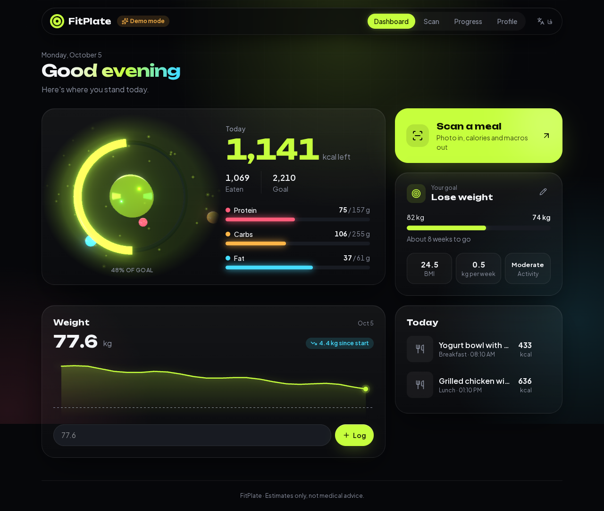
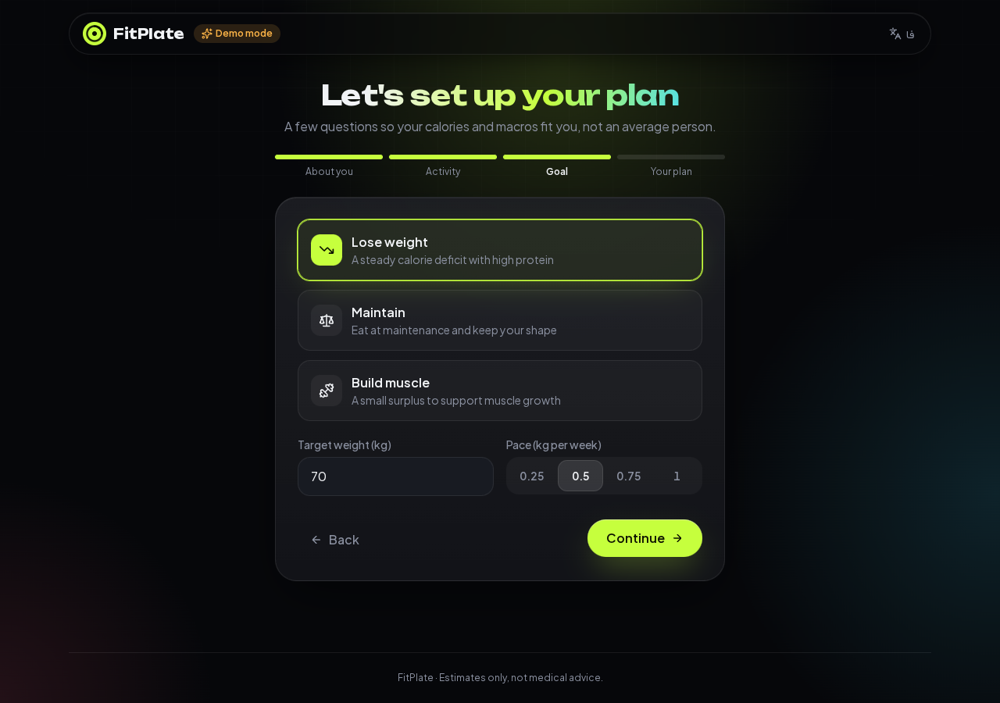
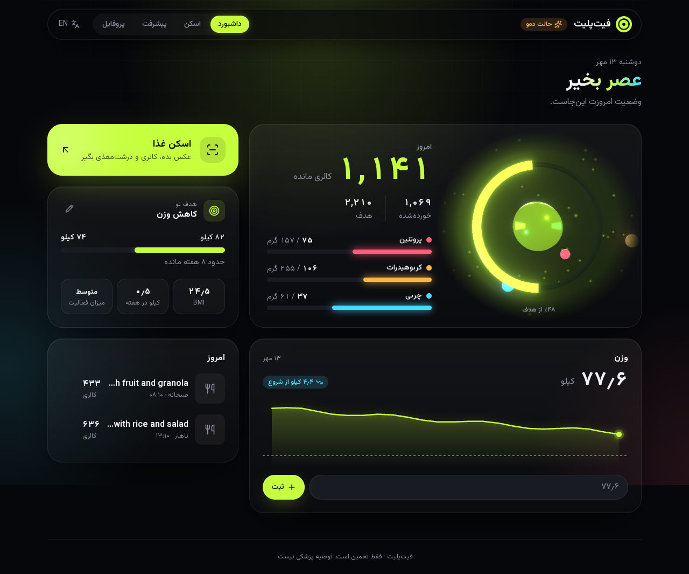
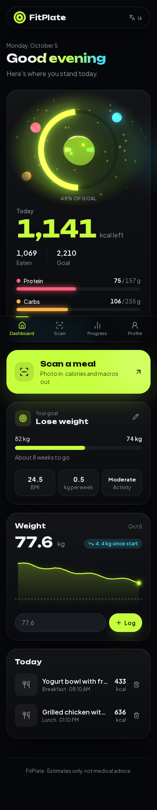
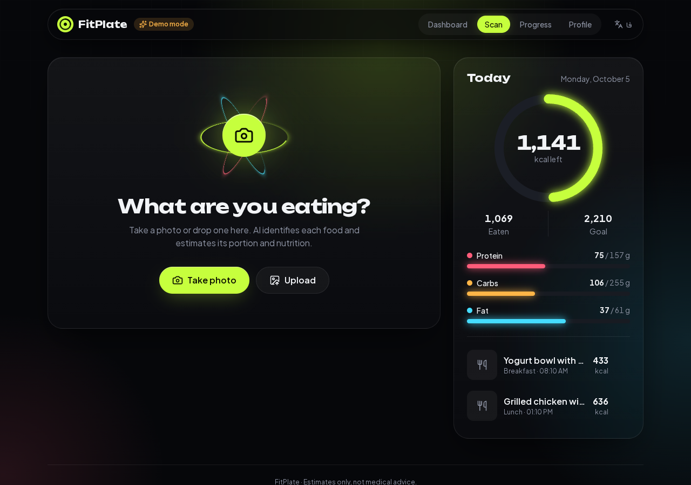
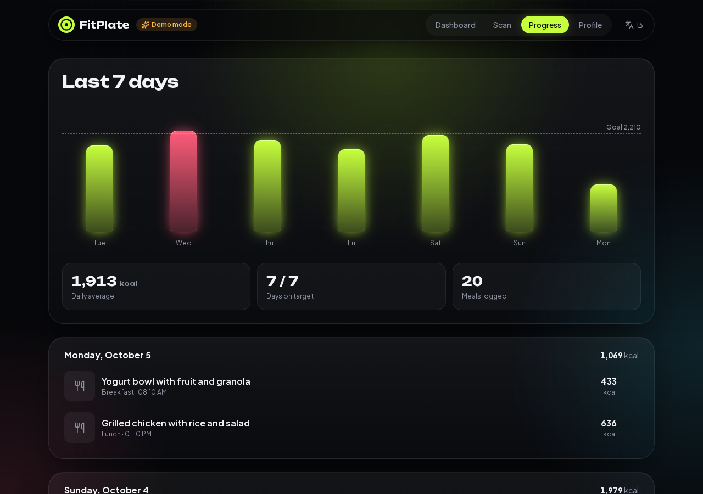
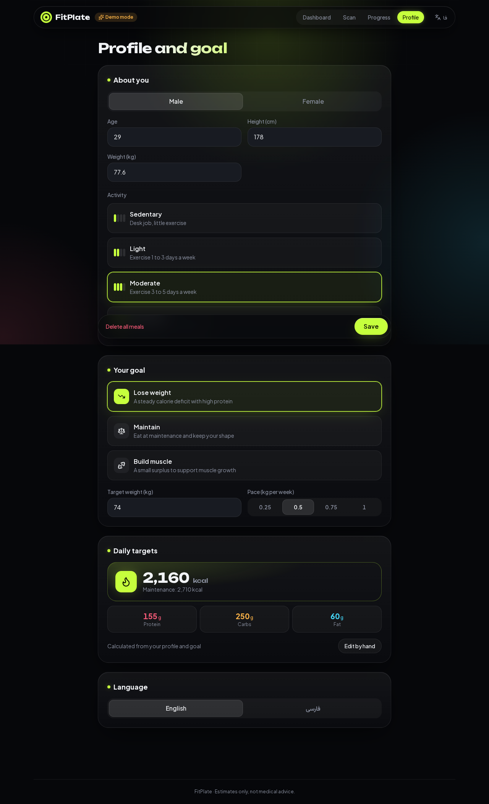

# FitPlate: your nutrition and fitness dashboard

FitPlate builds daily calorie and macro targets from your body and your goal, then helps you hit them. Log meals by snapping a photo (AI identifies each food and estimates its nutrition), track your weight against a target, and see your progress at a glance. Works in English and Persian (full RTL), on phones and desktops, with a dark glass interface and a real-time 3D scene on the dashboard.



| Onboarding | Persian (RTL) | Mobile |
| --- | --- | --- |
|  |  |  |

| Scan | Progress | Profile |
| --- | --- | --- |
|  |  |  |

## Features

- **Personal targets.** A short onboarding asks for sex, age, height, weight, activity and goal (lose, maintain or build muscle, with a target weight and weekly pace). Calories come from Mifflin-St Jeor maintenance plus or minus the deficit or surplus for that pace, with a safety floor; protein is set per kg of body weight, fat at 25% of calories, and carbs fill the rest. Targets can also be set by hand.
- **3D dashboard.** A Three.js scene (React Three Fiber) shows today's calories as a glowing ring that fills toward the goal, with an orb per macro orbiting a distorted core; it follows the pointer, renders only while on screen, and falls back to a soft glow without WebGL. Cards tilt toward the cursor with a moving light, and numbers count up.
- **Dashboard**: calories left today, macro progress, goal progress with weeks to go and BMI, a weight trend chart with quick logging, and today's meals. Targets follow your weight as you log it.
- **Photo to nutrition.** Camera capture on phones, file upload, drag and drop, or paste from the clipboard. Each item gets an editable portion multiplier, and items the model got wrong can be removed.
- **Progress**: 7-day calorie chart against the goal line, daily average and days on target.
- **Bilingual** (English / فارسی) with RTL layout, Persian digits, Persian-digit input and the Persian calendar via `Intl`.
- **Demo mode**: without an API key the app returns realistic sample meals, so the whole flow can be shown without any cost.

## Roadmap

- Workout plans: weekly program, set and rep logging, and AI-suggested plans from your goal and equipment.
- Accounts and a database so each user's data follows them across devices, then a Vercel deployment.

## Stack

Next.js 16 (App Router, Route Handlers) · React 19 · TypeScript · Tailwind CSS v4 · Zustand (persisted to `localStorage`, with versioned migrations) · Motion · Three.js (React Three Fiber, drei, postprocessing) · Zod · Claude API or Google Gemini (vision + structured JSON output) · Vitest

## How it works

```
Browser                                  Server (Route Handler)                 Claude API
───────                                  ──────────────────────                 ──────────
pick photo → resize to ≤1280px JPEG  →   POST /api/analyze
                                          validate with Zod
                                          no key? → sample meal (demo)
                                          else → image + prompt  ───────────→   Claude or Gemini
                                                                  ←───────────  JSON matching AnalysisSchema
render result, edit portions       ←     { ok, mode, analysis }
log meal → Zustand → localStorage
```

The response shape is defined once in [`src/lib/schema.ts`](src/lib/schema.ts) as a Zod schema. The same schema validates requests, types the UI, and is sent to the model as its required JSON output format. Each provider lives behind one function in [`src/lib/providers/`](src/lib/providers), so adding another is a single file. API keys only ever live on the server.

## Run it

```bash
npm install
cp .env.example .env.local   # optional: add GEMINI_API_KEY (free tier) or ANTHROPIC_API_KEY
npm run dev
```

Open http://localhost:3000. Without a key the header shows **Demo mode**.

| Variable | Purpose |
| --- | --- |
| `GEMINI_API_KEY` | Live analysis with Google Gemini, which has a free tier with rate limits. Get one at https://aistudio.google.com/apikey |
| `GEMINI_MODEL` | Optional. Defaults to `gemini-flash-latest` |
| `ANTHROPIC_API_KEY` | Live analysis with Claude (paid per use). Get one at https://console.anthropic.com |
| `ANTHROPIC_MODEL` | Optional. Defaults to `claude-opus-5-5`; `claude-sonnet-5-5` costs about half |
| `AI_PROVIDER` | `claude` or `gemini`, when both keys are set. Defaults to Claude |
| `DEMO_MODE` | Set to `true` to force sample results even when a key is set (handy for a public demo) |

## Scripts

```bash
npm run dev        # dev server
npm run build      # production build
npm test           # unit tests (nutrition math, dates, schemas)
npm run lint
npm run typecheck
```

## Project layout

```
src/
  app/
    api/analyze/route.ts   POST: photo → analysis; GET: live or demo mode
    page.tsx               dashboard
    onboarding/page.tsx    profile and goal setup
    scan/page.tsx          photo scanner + today
    history/page.tsx       7-day progress
    profile/page.tsx       edit profile, goal and targets
  components/              Dashboard, Onboarding, PlanForm, WeightCard, GoalCard, Scanner, AnalysisResult, …
  lib/
    analyze.ts             picks the provider from the keys that are set (server only)
    providers/             claude.ts, gemini.ts, shared prompt and errors
    schema.ts              Zod schemas shared by client and server
    nutrition.ts           scaling, totals, maintenance and goal-based targets
    store.ts               Zustand store with persistence
    useScanner.ts          photo → API → result state machine
    i18n.ts                English and Persian strings
```

Nutrition values are estimates and not medical advice.
