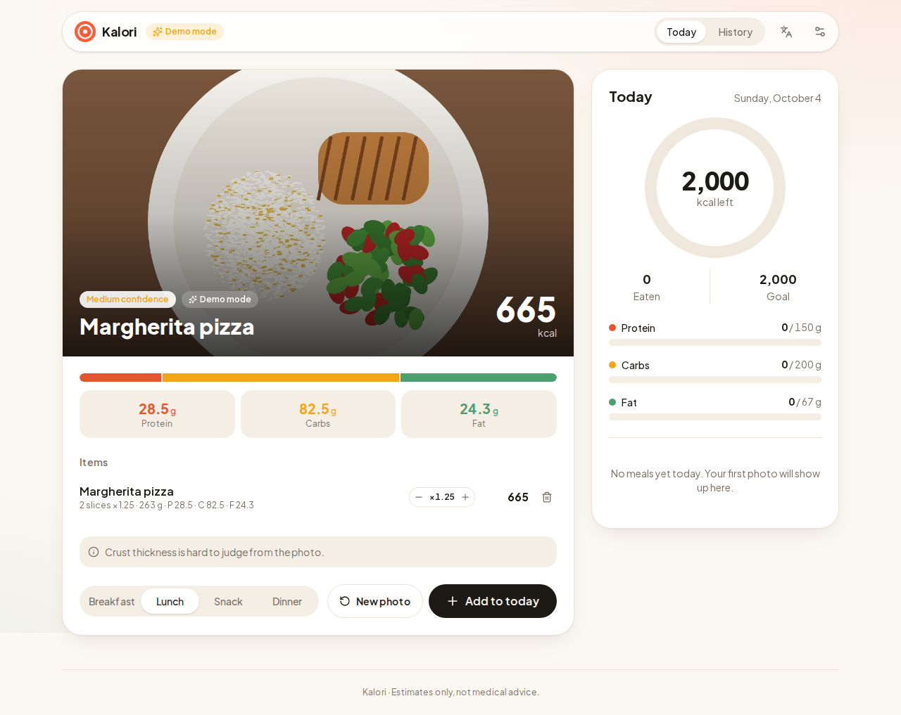
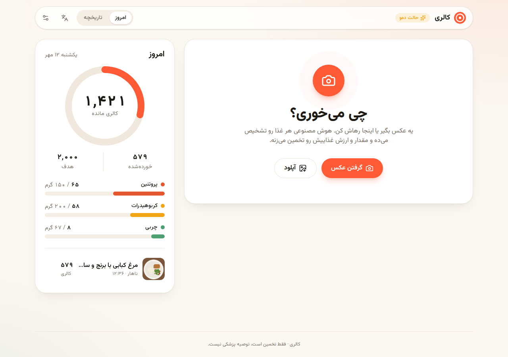

# Kalori: calories from a photo

Snap or drop a photo of a meal. Kalori identifies each food, estimates the portion, and returns calories, protein, carbs and fat. Adjust portions, log the meal, and track your day and week against a personal goal. Works in English and Persian (full RTL), in light and dark mode, on phones and desktops.



| Today (Persian, RTL) | History | Mobile |
| --- | --- | --- |
|  |  |  |

## Features

- **Photo to nutrition.** Camera capture on phones, file upload, drag and drop, or paste from the clipboard. Photos are resized in the browser before upload.
- **Per-item breakdown** with an editable portion multiplier and the ability to drop items the model got wrong; totals update live.
- **Daily dashboard**: animated calorie ring, macro progress against targets, and the day's meals with thumbnails.
- **7-day history** with a goal line, daily average and days on target.
- **Goal calculator** using the Mifflin-St Jeor equation and an activity factor.
- **Bilingual** (English / فارسی) with RTL layout, Persian digits and the Persian calendar via `Intl`.
- **Demo mode**: without an API key the app returns realistic sample meals, so the whole flow can be shown without any cost.

## Stack

Next.js 16 (App Router, Route Handlers) · React 19 · TypeScript · Tailwind CSS v4 · Zustand (persisted to `localStorage`) · Motion · Zod · Claude API or Google Gemini (vision + structured JSON output) · Vitest

## How it works

```
Browser                                  Server (Route Handler)                 Claude API
───────                                  ──────────────────────                 ──────────
pick photo → resize to ≤1280px JPEG  →   POST /api/analyze
                                          validate with Zod
                                          no key? → sample meal (demo)
                                          else → image + prompt  ───────────→   Claude or Gemini
                                                                  ←───────────  JSON matching AnalysisSchema
render result, edit portions       ←     { ok, mode, analysis }
log meal → Zustand → localStorage
```

The response shape is defined once in [`src/lib/schema.ts`](src/lib/schema.ts) as a Zod schema. The same schema validates requests, types the UI, and is sent to the model as its required JSON output format. Each provider lives behind one function in [`src/lib/providers/`](src/lib/providers), so adding another is a single file. API keys only ever live on the server.

## Run it

```bash
npm install
cp .env.example .env.local   # optional: add GEMINI_API_KEY (free tier) or ANTHROPIC_API_KEY
npm run dev
```

Open http://localhost:3000. Without a key the header shows **Demo mode**.

| Variable | Purpose |
| --- | --- |
| `GEMINI_API_KEY` | Live analysis with Google Gemini, which has a free tier with rate limits. Get one at https://aistudio.google.com/apikey |
| `GEMINI_MODEL` | Optional. Defaults to `gemini-flash-latest` |
| `ANTHROPIC_API_KEY` | Live analysis with Claude (paid per use). Get one at https://console.anthropic.com |
| `ANTHROPIC_MODEL` | Optional. Defaults to `claude-opus-5-5`; `claude-sonnet-5-5` costs about half |
| `AI_PROVIDER` | `claude` or `gemini`, when both keys are set. Defaults to Claude |
| `DEMO_MODE` | Set to `true` to force sample results even when a key is set (handy for a public demo) |

## Scripts

```bash
npm run dev        # dev server
npm run build      # production build
npm test           # unit tests (nutrition math, dates, schemas)
npm run lint
npm run typecheck
```

## Project layout

```
src/
  app/
    api/analyze/route.ts   POST: photo → analysis; GET: live or demo mode
    page.tsx               scanner + today
    history/page.tsx       7-day history
  components/              Scanner, AnalysisResult, TodayPanel, CalorieRing, WeekChart, SettingsDialog, …
  lib/
    analyze.ts             picks the provider from the keys that are set (server only)
    providers/             claude.ts, gemini.ts, shared prompt and errors
    schema.ts              Zod schemas shared by client and server
    nutrition.ts           scaling, totals, goal math
    store.ts               Zustand store with persistence
    useScanner.ts          photo → API → result state machine
    i18n.ts                English and Persian strings
```

Nutrition values are estimates and not medical advice.
